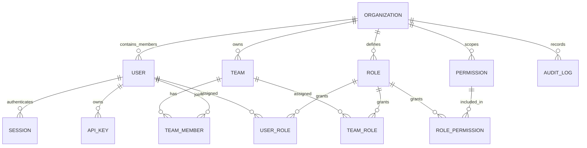
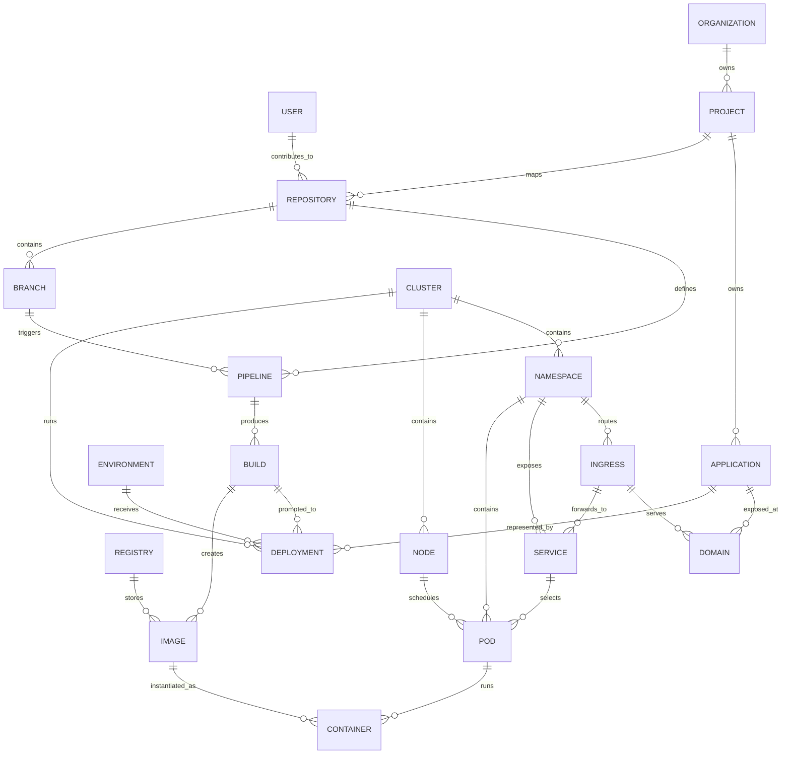
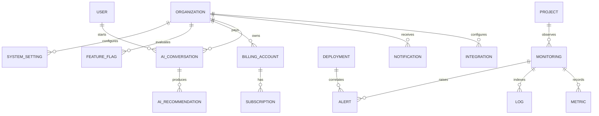

# SkyOps Entity Relationship Design

## Purpose

This document defines the conceptual entity relationship design for the SkyOps PostgreSQL database. It is a database design artifact only and intentionally contains no SQL, migrations, or backend implementation code.

## Relationship Diagram: Core Tenancy, Identity, and Access

## Relationship Diagram: Delivery and Topology Graph

## Relationship Diagram: Operations, AI, Integrations, and Commercial

## Entity Standards

Each entity below includes purpose, description, relationships, ownership, foreign keys, index strategy, soft delete strategy, and audit requirements. Field names are conceptual and are not SQL definitions.

### 1. Organization

- **Purpose:** Represents the top-level enterprise tenant and billing/security boundary.
- **Description:** Stores organization identity, slug, display name, lifecycle status, plan tier, region, compliance settings, and tenant metadata.
- **Relationships:** Owns users, teams, roles, permissions, projects, integrations, audit logs, billing accounts, feature flags, and settings.
- **Ownership:** Organizations and tenancy domain.
- **Foreign Keys:** Optional parent enterprise account for future reseller or multi-organization enterprise grouping; references created-by user where available.
- **Index Strategy:** Unique slug; status and region indexes for operations; partial active organization index.
- **Soft Delete Strategy:** Soft delete by default; hard delete only through approved legal erasure workflow after retention checks.
- **Audit Requirements:** Audit creation, suspension, reactivation, deletion, plan changes, region changes, and security setting changes.

### 2. User

- **Purpose:** Represents a human identity that can access SkyOps.
- **Description:** Stores identity profile metadata, external identity provider links, email verification state, lifecycle status, and security posture.
- **Relationships:** Belongs to organizations through membership, joins teams, receives roles, owns sessions, API keys, AI conversations, audit actions, and developer topology edges.
- **Ownership:** Identity and access domain.
- **Foreign Keys:** Organization membership references organization; user roles reference roles; sessions and API keys reference user.
- **Index Strategy:** Unique normalized email per identity realm; external provider ID index; organization membership composite index.
- **Soft Delete Strategy:** Soft delete or anonymize depending on legal requirements; preserve immutable audit actor references.
- **Audit Requirements:** Audit login-sensitive profile changes, status changes, MFA changes, organization joins/leaves, and role assignments.

### 3. Team

- **Purpose:** Groups users for authorization, ownership, notifications, and operational responsibility.
- **Description:** Stores team name, slug, description, ownership metadata, and status within an organization.
- **Relationships:** Belongs to organization; has team members; receives roles; may own projects, repositories, environments, and alert routes.
- **Ownership:** Identity and access domain with references from product domains.
- **Foreign Keys:** Organization, optional parent team, created-by user.
- **Index Strategy:** Unique organization plus slug; organization plus status; membership lookup indexes.
- **Soft Delete Strategy:** Soft delete with membership and assignment retention for audit history.
- **Audit Requirements:** Audit team creation, membership changes, role assignments, ownership changes, and deletion.

### 4. Role

- **Purpose:** Defines a named set of permissions assignable to users or teams.
- **Description:** Stores role name, scope, description, system/custom indicator, and lifecycle status.
- **Relationships:** Belongs to organization or global system scope; maps to permissions; assigned to users and teams.
- **Ownership:** Identity and authorization domain.
- **Foreign Keys:** Organization for custom roles; role-permission references permissions; assignments reference user or team.
- **Index Strategy:** Unique organization plus role key; scope and system-role indexes.
- **Soft Delete Strategy:** Soft delete custom roles only after assignments are removed or migrated; system roles are not deleted.
- **Audit Requirements:** Audit permission changes, assignments, revocations, and role lifecycle changes.

### 5. Permission

- **Purpose:** Represents an atomic action or capability that authorization policies can evaluate.
- **Description:** Stores permission key, resource type, action, scope, description, and risk level.
- **Relationships:** Referenced by roles and policy evaluation records.
- **Ownership:** Identity and authorization domain.
- **Foreign Keys:** Optional organization for tenant-specific permissions; otherwise global.
- **Index Strategy:** Unique permission key; resource/action composite index.
- **Soft Delete Strategy:** Deprecate before removal; do not delete while referenced by roles or audit records.
- **Audit Requirements:** Audit creation, deprecation, risk-level changes, and role mapping changes.

### 6. Project

- **Purpose:** Represents a product or platform work area inside an organization.
- **Description:** Stores project name, slug, description, owners, lifecycle state, default environments, and governance settings.
- **Relationships:** Belongs to organization; owns repositories, environments, applications, deployments, monitoring scope, alerts, and topology graph roots.
- **Ownership:** Organizations and tenancy domain with product-domain references.
- **Foreign Keys:** Organization, optional workspace, owner team, created-by user.
- **Index Strategy:** Unique organization plus slug; owner team lookup; active project partial index.
- **Soft Delete Strategy:** Soft delete with child resources retained for audit and historical topology.
- **Audit Requirements:** Audit creation, ownership changes, environment binding changes, policy changes, archival, and deletion.

### 7. Repository

- **Purpose:** Represents a source code repository connected to SkyOps.
- **Description:** Stores provider, external repository ID, URL metadata, default branch, visibility, installation binding, and project mapping.
- **Relationships:** Belongs to organization and project; contains branches; defines or triggers pipelines; connects developer commits to delivery lineage.
- **Ownership:** Source repositories domain.
- **Foreign Keys:** Organization, project, integration, owner team, created-by user.
- **Index Strategy:** Organization plus provider external ID; project plus repository slug; webhook lookup by installation/provider.
- **Soft Delete Strategy:** Soft delete on disconnect; retain historical pipeline, build, and deployment lineage.
- **Audit Requirements:** Audit connect, disconnect, provider permission changes, project remapping, and webhook configuration changes.

### 8. Branch

- **Purpose:** Represents a repository branch used for pipeline and deployment lineage.
- **Description:** Stores branch name, normalized reference, head commit metadata, protection status, and last observed timestamp.
- **Relationships:** Belongs to repository; triggers pipelines and builds; may map to environments or deployment policies.
- **Ownership:** Source repositories domain.
- **Foreign Keys:** Organization, project, repository, last observed by integration event where applicable.
- **Index Strategy:** Repository plus normalized branch name; organization plus updated timestamp for sync jobs.
- **Soft Delete Strategy:** Mark as deleted when provider branch disappears; retain for historical runs.
- **Audit Requirements:** Audit protected branch policy changes and environment binding changes.

### 9. Pipeline

- **Purpose:** Represents a CI/CD workflow definition and execution family.
- **Description:** Stores pipeline definition identity, source configuration, trigger rules, current version, status, and governance controls.
- **Relationships:** Belongs to organization, project, repository, and optionally branch; produces builds and deployment candidates.
- **Ownership:** CI/CD pipelines domain.
- **Foreign Keys:** Organization, project, repository, branch, environment for scoped pipelines, created-by user.
- **Index Strategy:** Project plus status; repository plus branch; trigger lookup by repository event; tenant plus updated timestamp.
- **Soft Delete Strategy:** Soft delete definitions; retain build history and immutable run facts.
- **Audit Requirements:** Audit definition changes, trigger changes, approval policy changes, disable/enable, and deletion.

### 10. Build

- **Purpose:** Represents an immutable pipeline execution or build run.
- **Description:** Stores run number, commit SHA, status, start/end times, actor, logs reference, artifact summary, and provenance metadata.
- **Relationships:** Belongs to pipeline, repository, branch, organization, and project; produces images; may initiate deployments.
- **Ownership:** CI/CD pipelines and artifacts domains.
- **Foreign Keys:** Organization, project, repository, branch, pipeline, actor user or service account.
- **Index Strategy:** Pipeline plus run number; repository plus commit SHA; project plus status/time; partition by time for large volume.
- **Soft Delete Strategy:** Immutable history; purge or archive according to retention after preserving required audit/provenance.
- **Audit Requirements:** Audit manual run, cancellation, retry, approval, status transition, and artifact publication.

### 11. Deployment

- **Purpose:** Represents a release of an artifact or configuration to an environment and runtime target.
- **Description:** Stores deployment version, status, strategy, approvals, rollback link, health summary, and runtime binding.
- **Relationships:** Belongs to organization, project, environment, cluster, application, pipeline/build, and image; connects delivery to Kubernetes resources.
- **Ownership:** Deployments and releases domain.
- **Foreign Keys:** Organization, project, environment, cluster, application, build, image, actor user/service account.
- **Index Strategy:** Environment plus status/time; application plus current deployment; build-to-deployment lineage; cluster plus active deployments.
- **Soft Delete Strategy:** Retain immutable deployment records; archive old deployments by retention policy.
- **Audit Requirements:** Audit creation, approval, promotion, rollback, cancellation, failure, and production-impacting changes.

### 12. Environment

- **Purpose:** Represents a logical delivery target such as development, staging, production, preview, or sandbox.
- **Description:** Stores environment name, slug, type, protection rules, variable references, approval policy, and runtime bindings.
- **Relationships:** Belongs to organization and project; has deployments, clusters, namespaces, secrets, config maps, and policy gates.
- **Ownership:** Environments domain.
- **Foreign Keys:** Organization, project, owner team, default cluster, created-by user.
- **Index Strategy:** Unique project plus slug; organization plus type; protected environment lookup.
- **Soft Delete Strategy:** Soft delete after active deployments and runtime bindings are removed or archived.
- **Audit Requirements:** Audit protection changes, variable reference changes, cluster bindings, approval rules, and deletion.

### 13. Cluster

- **Purpose:** Represents a Kubernetes cluster managed or observed by SkyOps.
- **Description:** Stores cluster identity, provider, region, connection status, version, labels, tenancy mode, and health metadata.
- **Relationships:** Belongs to organization and optionally environment/project; contains namespaces and nodes; receives deployments.
- **Ownership:** Kubernetes operations domain.
- **Foreign Keys:** Organization, integration, environment for primary binding, owner team.
- **Index Strategy:** Organization plus provider external ID; region/status lookup; connection health lookup.
- **Soft Delete Strategy:** Soft delete when disconnected; retain historical deployment and topology references.
- **Audit Requirements:** Audit connect, disconnect, credential reference changes, permission changes, and destructive operations.

### 14. Namespace

- **Purpose:** Represents a Kubernetes namespace within a cluster.
- **Description:** Stores namespace name, Kubernetes UID, labels, annotations summary, lifecycle status, and environment/project binding.
- **Relationships:** Belongs to cluster and organization; contains pods, services, ingresses, secrets, and config maps.
- **Ownership:** Kubernetes operations domain.
- **Foreign Keys:** Organization, cluster, project, environment.
- **Index Strategy:** Unique cluster plus namespace name; environment plus namespace; Kubernetes UID lookup.
- **Soft Delete Strategy:** Mark deleted when removed from cluster; retain historical resource relationships.
- **Audit Requirements:** Audit creation through SkyOps, deletion, project/environment binding changes, and policy exceptions.

### 15. Node

- **Purpose:** Represents a Kubernetes worker or control-plane node observed by SkyOps.
- **Description:** Stores node name, provider ID, Kubernetes UID, capacity summary, labels, taints, status, and discovery timestamps.
- **Relationships:** Belongs to cluster; schedules pods; contributes to topology and capacity monitoring.
- **Ownership:** Kubernetes operations domain.
- **Foreign Keys:** Organization, cluster.
- **Index Strategy:** Cluster plus node name; provider ID; status and readiness indexes.
- **Soft Delete Strategy:** Mark deleted or not observed after cluster removal; high-churn node history may be archived.
- **Audit Requirements:** Audit SkyOps-initiated cordon, drain, label, taint, or remediation actions.

### 16. Pod

- **Purpose:** Represents a Kubernetes pod runtime instance.
- **Description:** Stores pod name, UID, owner references, phase, restart count summary, labels, service selectors, and observed time range.
- **Relationships:** Belongs to organization, cluster, namespace, node, deployment/application where resolvable; contains containers; selected by services.
- **Ownership:** Kubernetes operations domain.
- **Foreign Keys:** Organization, cluster, namespace, node, deployment, application.
- **Index Strategy:** Namespace plus pod name; Kubernetes UID; node plus phase; deployment/application plus observed time.
- **Soft Delete Strategy:** Runtime record marked terminated/deleted; pod history retained short term then archived or summarized.
- **Audit Requirements:** Audit SkyOps-initiated delete, restart, exec-like operations, and policy actions.

### 17. Container

- **Purpose:** Represents a container instance running inside a pod.
- **Description:** Stores container name, image reference, image digest, runtime status, restart count, resource requests/limits, and security context summary.
- **Relationships:** Belongs to pod; references image when known; participates in topology from build artifact to runtime.
- **Ownership:** Kubernetes operations and artifacts domains.
- **Foreign Keys:** Organization, cluster, namespace, pod, image.
- **Index Strategy:** Pod plus container name; image digest lookup; status/restart indexes for diagnostics.
- **Soft Delete Strategy:** Retained with pod lifecycle; summarized or archived after runtime retention.
- **Audit Requirements:** Audit SkyOps-initiated runtime actions and security policy exceptions.

### 18. Service

- **Purpose:** Represents a Kubernetes Service exposing pods.
- **Description:** Stores service name, UID, type, selectors, ports, cluster IP metadata, labels, and observed status.
- **Relationships:** Belongs to namespace and cluster; selects pods; is targeted by ingresses; may map to application endpoints.
- **Ownership:** Kubernetes operations domain.
- **Foreign Keys:** Organization, cluster, namespace, application where resolvable.
- **Index Strategy:** Namespace plus service name; Kubernetes UID; application plus active service.
- **Soft Delete Strategy:** Mark deleted when absent from cluster; retain for topology history.
- **Audit Requirements:** Audit SkyOps-initiated create/update/delete and exposure changes.

### 19. Ingress

- **Purpose:** Represents an ingress or gateway route exposing services to domains.
- **Description:** Stores ingress name, UID, class, host rules, path rules, TLS references, status, and external address summary.
- **Relationships:** Belongs to namespace and cluster; forwards to services; serves domains; exposes applications.
- **Ownership:** Kubernetes operations domain.
- **Foreign Keys:** Organization, cluster, namespace, service, application.
- **Index Strategy:** Namespace plus ingress name; host/domain lookup; application plus active ingress.
- **Soft Delete Strategy:** Mark deleted when absent; retain historical exposure records.
- **Audit Requirements:** Audit exposure changes, TLS changes, route changes, and deletion.

### 20. Secret

- **Purpose:** Represents secret metadata and references without storing plaintext secret values.
- **Description:** Stores secret name, provider reference, version, fingerprint, scope, rotation status, and usage metadata.
- **Relationships:** Belongs to organization, project, environment, cluster, or namespace; may be referenced by deployments and workloads.
- **Ownership:** Security and environments domains.
- **Foreign Keys:** Organization, project, environment, cluster, namespace, integration for secret provider.
- **Index Strategy:** Scope plus name; provider reference; rotation due date; active secret partial index.
- **Soft Delete Strategy:** Soft delete metadata; secret value deletion handled by external secret manager policy.
- **Audit Requirements:** Audit creation, reference changes, rotation, access policy changes, and deletion; never audit plaintext values.

### 21. ConfigMap

- **Purpose:** Represents non-secret configuration metadata used by workloads.
- **Description:** Stores config map name, scope, version, key summary, checksum, and runtime binding metadata.
- **Relationships:** Belongs to organization, project, environment, cluster, and namespace; referenced by deployments and pods.
- **Ownership:** Environments and Kubernetes operations domains.
- **Foreign Keys:** Organization, project, environment, cluster, namespace.
- **Index Strategy:** Scope plus name; checksum lookup; environment plus active config maps.
- **Soft Delete Strategy:** Soft delete and retain version history for rollback and audit.
- **Audit Requirements:** Audit creation, update, rollout-triggering changes, and deletion.

### 22. Registry

- **Purpose:** Represents a container registry integration or internal registry namespace.
- **Description:** Stores registry provider, endpoint, account/namespace, connection status, credential reference, and policy metadata.
- **Relationships:** Belongs to organization; stores images; integrates with artifact, security, and deployment domains.
- **Ownership:** Artifacts and images domain.
- **Foreign Keys:** Organization, integration, owner team.
- **Index Strategy:** Organization plus provider endpoint; status lookup; namespace lookup.
- **Soft Delete Strategy:** Soft delete on disconnect; retain image metadata and deployment lineage.
- **Audit Requirements:** Audit connect, disconnect, credential reference changes, scan policy changes, and access changes.

### 23. Image

- **Purpose:** Represents a container image artifact and its supply-chain metadata.
- **Description:** Stores repository name, tag, digest, architecture, SBOM reference, provenance, signing status, vulnerability summary, and promotion state.
- **Relationships:** Belongs to registry and organization; produced by builds; used by deployments and containers.
- **Ownership:** Artifacts and images domain.
- **Foreign Keys:** Organization, registry, build, project, repository.
- **Index Strategy:** Registry plus digest; build lineage; project plus promotion state; vulnerability status lookup.
- **Soft Delete Strategy:** Retain metadata after registry deletion; archive old unreferenced images by policy.
- **Audit Requirements:** Audit publication, promotion, signing status, scan results, and deletion/retention actions.

### 24. Monitoring

- **Purpose:** Represents observability configuration and scoped monitoring context.
- **Description:** Stores monitoring source, scrape/query configuration metadata, SLO associations, service mappings, and health status.
- **Relationships:** Belongs to organization and project; connects to integrations, metrics, logs, alerts, deployments, and applications.
- **Ownership:** Observability domain.
- **Foreign Keys:** Organization, project, integration, application, environment.
- **Index Strategy:** Project plus source; application plus active monitoring; health status lookup.
- **Soft Delete Strategy:** Soft delete configuration; telemetry retention is handled separately.
- **Audit Requirements:** Audit source changes, SLO changes, alert route changes, and disable/delete events.

### 25. Metric

- **Purpose:** Represents metric metadata or sampled metric data needed by SkyOps product workflows.
- **Description:** Stores metric identity, labels, timestamp, value summary or pointer, source, and correlation to deployment/application where available.
- **Relationships:** Belongs to monitoring context, organization, project, environment, application, deployment, cluster, or pod depending on source.
- **Ownership:** Observability domain.
- **Foreign Keys:** Organization, monitoring, project, environment, application, deployment, cluster, pod as applicable.
- **Index Strategy:** Time partitioning; metric name plus time; tenant plus source; deployment/application correlation indexes.
- **Soft Delete Strategy:** No soft delete for samples; expire partitions by retention. Metadata may be soft deleted.
- **Audit Requirements:** Audit monitoring configuration changes, not every metric sample.

### 26. Log

- **Purpose:** Represents log metadata, index envelopes, or pointers to external log storage.
- **Description:** Stores timestamp, source, severity, trace/correlation IDs, resource references, redaction status, and storage pointer.
- **Relationships:** Belongs to organization, project, environment, deployment, cluster, namespace, pod, container, or application when resolvable.
- **Ownership:** Logging domain.
- **Foreign Keys:** Organization, project, environment, deployment, cluster, namespace, pod, container, application.
- **Index Strategy:** Time partitioning; tenant plus severity/time; trace ID; deployment and pod correlation.
- **Soft Delete Strategy:** Expire by retention partitions; do not soft delete individual high-volume log rows.
- **Audit Requirements:** Audit log source configuration and export/access events for sensitive logs.

### 27. Alert

- **Purpose:** Represents an alert, incident signal, or policy violation requiring attention.
- **Description:** Stores alert rule, severity, status, deduplication key, source, affected entity, timestamps, and resolution metadata.
- **Relationships:** Belongs to organization, project, monitoring source, application, deployment, environment, cluster, or security context; creates notifications.
- **Ownership:** Observability and notifications domains.
- **Foreign Keys:** Organization, project, monitoring, application, deployment, environment, cluster, notification where applicable.
- **Index Strategy:** Tenant plus status/severity; affected entity lookup; deduplication key; time partitioning for alert events.
- **Soft Delete Strategy:** Soft delete alert definitions; retain alert occurrences by retention and archive policy.
- **Audit Requirements:** Audit acknowledgement, assignment, suppression, resolution, escalation, and rule changes.

### 28. AI Conversation

- **Purpose:** Represents an AI-assisted interaction within tenant boundaries.
- **Description:** Stores conversation metadata, user/service actor, scope, tool permissions, retention policy, and message references.
- **Relationships:** Belongs to organization and actor user; may reference project, deployment, alert, repository, or incident context; produces recommendations.
- **Ownership:** AI operations domain.
- **Foreign Keys:** Organization, user, project, deployment, alert, repository as optional context references.
- **Index Strategy:** Organization plus actor/time; context entity lookup; retention expiry index.
- **Soft Delete Strategy:** Soft delete conversation metadata; message content retention follows customer policy and privacy requirements.
- **Audit Requirements:** Audit tool use, privileged recommendations, data access scope, and user-triggered deletion.

### 29. AI Recommendation

- **Purpose:** Represents a recommendation, diagnosis, or proposed action generated by AI.
- **Description:** Stores recommendation type, confidence, rationale summary, target entity, policy status, approval status, and outcome.
- **Relationships:** Belongs to organization and AI conversation; references deployment, alert, pipeline, cluster, security finding, or project context.
- **Ownership:** AI operations domain.
- **Foreign Keys:** Organization, AI conversation, actor user/service, target entity references through typed target metadata and stable foreign keys where available.
- **Index Strategy:** Organization plus status/time; target entity lookup; approval status; recommendation type.
- **Soft Delete Strategy:** Retain approved/applied recommendations for audit; expire unapplied low-risk recommendations by policy.
- **Audit Requirements:** Audit generation, display, approval, rejection, execution, and outcome.

### 30. Notification

- **Purpose:** Represents a user, team, integration, or channel notification.
- **Description:** Stores recipient, channel, template, status, delivery attempts, deduplication key, and related entity context.
- **Relationships:** Belongs to organization; targets users, teams, alerts, deployments, billing events, or integrations.
- **Ownership:** Notifications domain.
- **Foreign Keys:** Organization, user, team, alert, deployment, integration as applicable.
- **Index Strategy:** Recipient plus unread/status; organization plus time; delivery status retry index; deduplication key.
- **Soft Delete Strategy:** Soft delete user-visible notifications; purge delivery attempts by retention.
- **Audit Requirements:** Audit preference changes and high-risk notification delivery failures; normal delivery events may be operational logs.

### 31. Integration

- **Purpose:** Represents an external system connection such as Git provider, registry, cloud, identity provider, observability tool, or notification channel.
- **Description:** Stores provider type, installation/account metadata, credential reference, status, scopes, webhook secret reference, and health.
- **Relationships:** Belongs to organization; used by repositories, registries, clusters, monitoring sources, notifications, and identity flows.
- **Ownership:** Integrations domain with domain-specific consumers.
- **Foreign Keys:** Organization, owner team, created-by user.
- **Index Strategy:** Organization plus provider/type; external account ID; status/health lookup.
- **Soft Delete Strategy:** Soft delete disconnects while retaining historical external IDs for audit and lineage.
- **Audit Requirements:** Audit connect, disconnect, scope changes, credential rotations, webhook changes, and failures affecting security.

### 32. Audit Log

- **Purpose:** Provides immutable evidence of security, administrative, delivery, AI, and operational actions.
- **Description:** Stores actor, action, target, tenant scope, result, reason, source, correlation IDs, and safe before/after summaries.
- **Relationships:** Belongs to organization; references actor user/service and target entities through typed references.
- **Ownership:** Audit domain.
- **Foreign Keys:** Organization, actor user where available; target references may be typed to avoid coupling every domain table.
- **Index Strategy:** Time partitioning; organization plus time; actor plus time; target entity; action/result filters.
- **Soft Delete Strategy:** Immutable and not soft-deleted; expires only through compliance retention and archival policy.
- **Audit Requirements:** Audit logs are themselves access-controlled; access and export of audit logs must also be audited.

### 33. API Key

- **Purpose:** Represents a non-human credential for API access or automation.
- **Description:** Stores key name, hashed secret, prefix, scopes, owner, expiration, last used summary, and revocation state.
- **Relationships:** Belongs to organization and user or service account; maps to roles/permissions and audit events.
- **Ownership:** Identity and access domain.
- **Foreign Keys:** Organization, owner user, role/scope assignments.
- **Index Strategy:** Key prefix lookup; owner plus status; expiration; last used time for cleanup.
- **Soft Delete Strategy:** Revoke first, then soft delete metadata; never store plaintext key material.
- **Audit Requirements:** Audit creation, use for sensitive actions, scope changes, expiration changes, revocation, and failed authentication.

### 34. Session

- **Purpose:** Represents an authenticated user session.
- **Description:** Stores session identifier digest, user, organization context, device summary, expiration, revocation, and risk metadata.
- **Relationships:** Belongs to user and organization context; creates audit and security events.
- **Ownership:** Identity and access domain.
- **Foreign Keys:** User, organization.
- **Index Strategy:** Session digest lookup; user plus active sessions; expiration index; revoked status.
- **Soft Delete Strategy:** Expire and purge according to security retention; retain summarized auth events in audit/security logs.
- **Audit Requirements:** Audit login, logout, revocation, suspicious activity, MFA changes, and administrative session termination.

### 35. Billing

- **Purpose:** Represents billing account and financial relationship for an organization.
- **Description:** Stores billing contact, billing provider customer reference, tax metadata, invoice status summary, usage rollup, and payment health.
- **Relationships:** Belongs to organization; owns subscriptions and usage records; references invoices through provider metadata.
- **Ownership:** Billing domain.
- **Foreign Keys:** Organization, billing owner user where available.
- **Index Strategy:** Organization unique billing account; provider customer ID; payment status lookup.
- **Soft Delete Strategy:** Retain according to financial retention; anonymize where legally required after account closure.
- **Audit Requirements:** Audit billing contact changes, provider binding changes, payment status changes, and invoice-related administrative actions.

### 36. Subscription

- **Purpose:** Represents the active or historical product subscription for an organization.
- **Description:** Stores plan, status, billing interval, effective dates, entitlements, limits, trial status, and provider subscription reference.
- **Relationships:** Belongs to billing account and organization; controls feature flags, quotas, and entitlements.
- **Ownership:** Billing domain.
- **Foreign Keys:** Organization, billing account.
- **Index Strategy:** Organization plus active status; provider subscription ID; renewal date index.
- **Soft Delete Strategy:** Do not delete historical subscriptions; end-date or cancel them for financial history.
- **Audit Requirements:** Audit plan changes, cancellations, renewals, trial conversions, and entitlement overrides.

### 37. Feature Flag

- **Purpose:** Represents feature rollout, entitlement, experiment, or operational kill switch configuration.
- **Description:** Stores flag key, scope, targeting rules summary, default state, lifecycle status, owner, and evaluation metadata.
- **Relationships:** May be global or organization/project scoped; can reference subscription entitlements and system settings.
- **Ownership:** Platform configuration domain.
- **Foreign Keys:** Organization for tenant-scoped flags, project for project-scoped flags, owner team.
- **Index Strategy:** Flag key plus scope; active flag lookup; owner team lookup.
- **Soft Delete Strategy:** Archive/deprecate before deletion; retain historical evaluations when needed for audit.
- **Audit Requirements:** Audit creation, targeting changes, enable/disable, rollout changes, and emergency kill-switch use.

### 38. System Settings

- **Purpose:** Represents global, organization, project, or environment configuration controlled by administrators.
- **Description:** Stores setting key, scope, value reference or serialized safe value, validation metadata, source, and status.
- **Relationships:** Applies to organizations, projects, environments, services, AI policies, security settings, and operational controls.
- **Ownership:** Platform configuration domain.
- **Foreign Keys:** Optional organization, project, environment, owner user/team depending on scope.
- **Index Strategy:** Scope plus key; active settings lookup; updated time for configuration propagation.
- **Soft Delete Strategy:** Soft delete to preserve configuration history; values with secrets must be references only.
- **Audit Requirements:** Audit all setting changes, especially security, AI, retention, and production operation settings.

### 39. Application

- **Purpose:** Represents the logical application or service that users operate through SkyOps topology.
- **Description:** Stores application name, slug, owner, lifecycle status, service tier, repository/deployment mappings, and domain exposure summary.
- **Relationships:** Belongs to organization and project; maps to repositories, deployments, services, ingresses, domains, monitoring, alerts, and topology graph nodes.
- **Ownership:** Platform/application catalog domain.
- **Foreign Keys:** Organization, project, owner team, primary repository, created-by user.
- **Index Strategy:** Unique project plus slug; owner team; service tier; active application partial index.
- **Soft Delete Strategy:** Soft delete after active deployments and domain mappings are retired; retain lineage for topology history.
- **Audit Requirements:** Audit creation, ownership changes, repository/deployment mappings, tier changes, and deletion.

### 40. Domain

- **Purpose:** Represents a DNS host or route domain exposed by SkyOps-managed applications.
- **Description:** Stores hostname, verification status, TLS status, ownership scope, ingress mapping, and application binding.
- **Relationships:** Belongs to organization and project; maps to ingress and application; participates in topology graph exposure path.
- **Ownership:** Kubernetes operations and application catalog domains.
- **Foreign Keys:** Organization, project, application, ingress, environment.
- **Index Strategy:** Unique hostname where globally managed; organization plus hostname; verification status; application lookup.
- **Soft Delete Strategy:** Soft delete when unbound; retain exposure history for audit and incident review.
- **Audit Requirements:** Audit domain verification, ownership changes, TLS changes, route changes, and removal.

## Topology Graph Queryability

The topology graph is queryable through explicit relationships:

1. Developer is represented by `User` and contribution/deployment actor relationships.
2. User membership connects developers to `Organization`.
3. `Project` belongs to organization.
4. `Repository` belongs to project.
5. `Branch` belongs to repository.
6. `Pipeline` belongs to repository and branch.
7. `Build` belongs to pipeline and records commit and actor.
8. `Image` references build and registry.
9. `Registry` owns image storage metadata.
10. `Deployment` references build, image, application, environment, and cluster.
11. `Cluster` contains nodes and namespaces.
12. `Node` schedules pods.
13. `Pod` belongs to namespace and node and may reference deployment/application.
14. `Container` belongs to pod and references image digest.
15. `Service` selects pods and exposes application workloads.
16. `Ingress` forwards to services.
17. `Domain` maps hostnames to ingresses and applications.
18. `Application` provides the product-level aggregate tying repository, deployment, runtime, monitoring, and exposure together.

Historical reconstruction uses immutable build, deployment, image, audit, and runtime observation records so the graph can answer both current-state and point-in-time questions.
